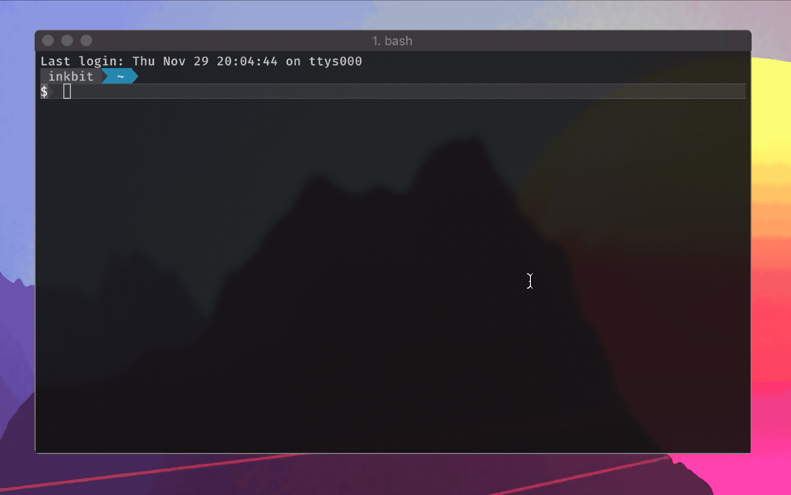

# uwquest

_A Golang client for the UWaterloo Quest API._

[![GoDoc: Documentation][godoc-img]][godoc]
[![Tags][tags-img]][tags]
[![Go Report Card][grp-img]][grp]

[godoc]: https://godoc.org/github.com/stevenxie/uwquest
[godoc-img]: https://godoc.org/github.com/stevenxie/uwquest?status.svg
[tags]: https://github.com/stevenxie/uwquest/tags
[tags-img]: https://img.shields.io/github/tag/stevenxie/uwquest.svg
[grp]: https://goreportcard.com/report/github.com/stevenxie/uwquest
[grp-img]: https://goreportcard.com/badge/github.com/stevenxie/uwquest

## Why?

I wanted to programmatically check my grades, and other stuff like that. Maybe
get my grades emailed to me when they come out? But I didn't find any good Quest
clients that could let me build those kinds of things.

So that's why I built this, with the hope that a time will come where anybody
can build programs that use information from Quest.

## Features

- [x] Quest login and authentication.
- [x] Fetching grades data from Quest.
- [ ] Fetching class schedule information.
- [ ] Unofficial transcripts?
- [ ] Course add / drop / shopping carts?

> _...and maybe more..._

## Usage

To use the `uwquest` package as a library, just open up your
[Golang](https://golang.org) project directory, and run:

```bash
go get -u github.com/stevenxie/uwquest
```

Then, start coding!

For example, here's a program that will fetch your grades for the Fall 2018
term:

```go
package main

import (
	"fmt"
	"log"

	"github.com/stevenxie/uwquest"
)

func main() {
	// Create a Quest client.
	quest, _ := uwquest.NewClient()

	// Login to Quest.
	if err := quest.Login("fhamphalladur", "mrgoose2018"); err != nil {
		log.Fatalf("Failed to login to Quest: %v", err)
	}

	// Fetch all study terms.
	terms, err := quest.Terms()
	if err != nil {
		log.Fatalf("Failed to fetch terms: %v", err)
	}

	// Find the term that's named "Fall 2018".
	var target *uwquest.Term
	for _, term := range terms {
		if term.Name == "Fall 2018" {
			target = term
		}
	}
	if target == nil {
		fmt.Println("No such term with the name 'Fall 2018' 😓")
	}

	// Fetch grade for the target term.
	grades, err := quest.Grades(target.ID)
	if err != nil {
		log.Fatalf("Failed to fetch grades: %v", err)
	}

	// Print grades.
	fmt.Println("Found grades for the Fall 2018 term:")
	for _, grade := range grades {
		fmt.Printf(" • %v\n", grade)
	}
}
```

This program will output something like:

```text
Found grades for the Fall 2018 term:
 • CourseGrade{ID: 0, Name: CS 245, Description: Logic and Computation, GradingBasis: Numeric Grading Basis, Units: 0.500000, Grade: DNW, GradePoints: 16.000000}
 • CourseGrade{ID: 1, Name: CS 246, Description: Object-Oriented Software Devel, GradingBasis: Numeric Grading Basis, Units: 0.500000, Grade: 71, GradePoints: 35.500000}
 • CourseGrade{ID: 2, Name: MATH 128, Description: Calculus 2 for the Sciences, GradingBasis: Numeric Grading Basis, Units: 0.500000, Grade: 62, GradePoints: 31.000000}
 • CourseGrade{ID: 3, Name: MATH 136, Description: Linear Algebra 1 (Hon Math), GradingBasis: Numeric Grading Basis, Units: 0.500000, Grade: 60, GradePoints: 30.000000}
```

## Example Programs

Check out the `examples/` directory for example programs, like `gradecheck`.
Some of these programs might be useful to you on their own, but if anything
they'll be a good way to understand how to make something with this library.

### [`gradecheck`](https://github.com/stevenxie/uwquest/tree/master/examples/gradecheck)

_`gradecheck` lists your grades._

It will check for the environment variables
`QUEST_USER` and `QUEST_PASS`, and if they don't exist it will ask you for
those missing values.



#### Installation:

_Make sure you have [Go](https://golang.org) installed._

```bash
## Download and install into $GOBIN:
$ go get github.com/stevenxie/uwquest/examples/gradecheck

## Run:
$ gradecheck
```

<br />

## Contributing

Want to help develop this? Just clone this repository (or a fork of it):

```bash
git clone git@github.com:stevenxie/uwquest
```

Make sure to set up git-hooks and other dependencies with:

```bash
make setup
```

<br />

## Disclaimer

Maybe you're looking at this and you're an employer. And... you think my grades
are really bad.

Um.

_Whoops?_

I'll try harder next term, I promise.

Please... please still consider hiring me...
